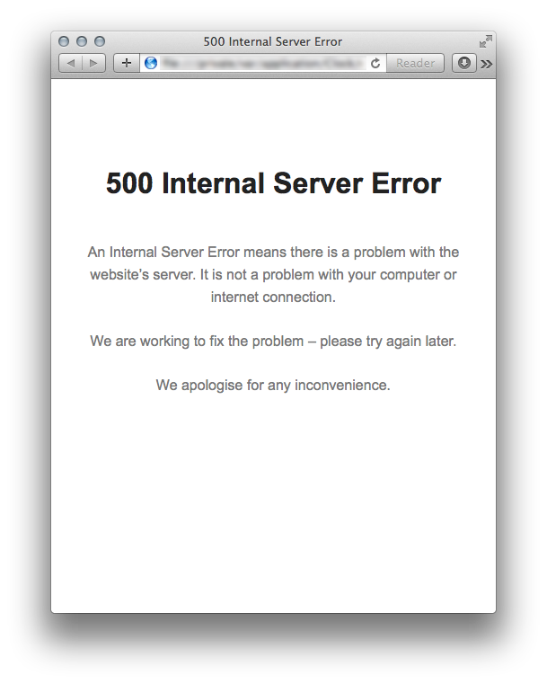

# Error Page

A super-simple minimal HTML page, optimised to be used for a static 500 error page or similar.

HTML is pre-minified and no external assets are required – all CSS is embedded.

## Example

